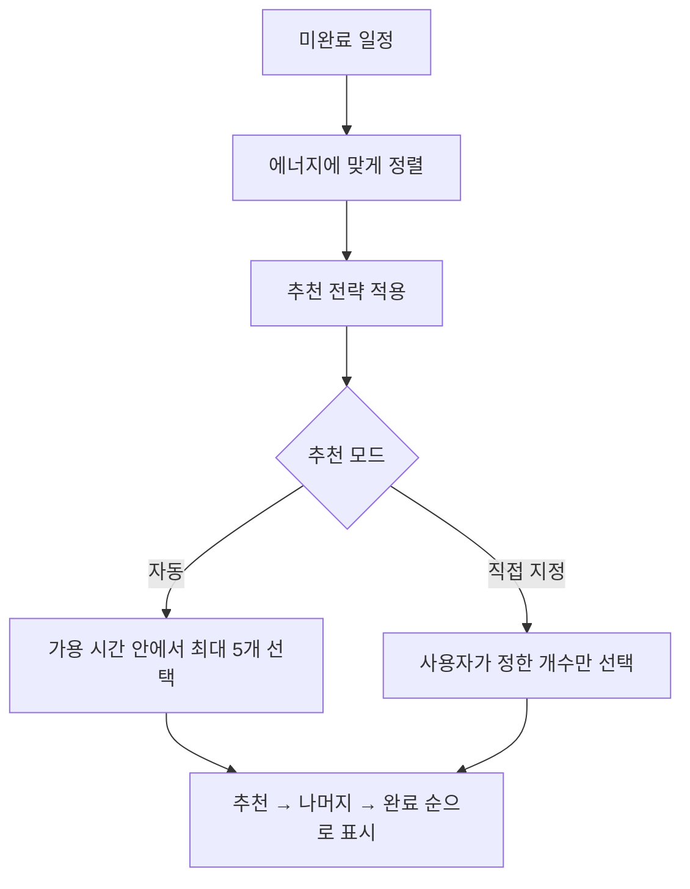
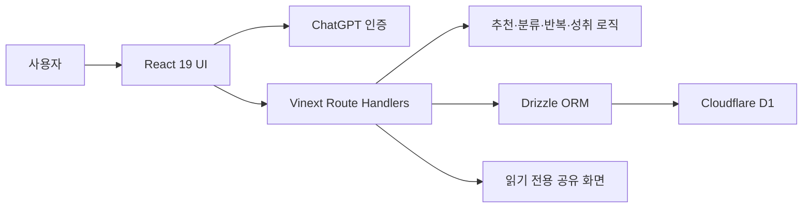

<div align="center">

# 오늘 뭐하지? · Today Focus

**해야 할 일은 많은데 무엇부터 시작할지 막막할 때,**<br>
현재 에너지와 사용할 수 있는 시간에 맞춰 오늘의 시작점을 정해 주는 일정 관리 서비스입니다.

[서비스 바로가기](https://today-focus.eunsil5523.chatgpt.site)

</div>

## QA 개선 기록

기능을 추가한 사실보다, 실제 사용 중 어떤 문제를 발견했고 어떻게 확인·개선했는지를 기록했습니다. 각 항목을 펼치면 문제 상황과 수정 방향을 볼 수 있습니다.

<details>
<summary><strong>랭킹 화면의 문구와 1위 카드 여백 개선</strong></summary>


- **발견:** 일반 일정용 돌곰이 문구가 랭킹 상태와 맞지 않았고, 참여자가 1명일 때 1위 카드의 빈 공간이 지나치게 크게 보였습니다.
- **개선:** 랭킹 화면에서는 일반 말풍선을 숨기고, 참여 인원과 주간·누적 집계 기준을 설명하는 전용 돌곰이 안내 박스를 배치했습니다.
- **검증:** 주간·누적 선택에 따라 안내 문구가 바뀌는지 확인하고, 관련 문구와 조건이 사라지지 않도록 회귀 테스트를 추가했습니다.

</details>

<details>
<summary><strong>일정 추가 후 캘린더가 바로 갱신되지 않는 문제</strong></summary>

- **발견:** 일정 등록은 성공했지만 이미 열어 둔 기록 캘린더에는 새 일정이 즉시 나타나지 않았습니다.
- **원인:** 월별 기록 결과가 이전 요청 상태를 유지해 일정 추가 사실을 알지 못했습니다.
- **개선:** 일정 변경 revision을 캘린더에 전달하고 기록 요청에 최신 데이터를 사용하도록 처리했습니다.
- **검증:** 로그인 사용자가 일정을 추가한 직후 현재 캘린더에 반영되는 조건을 자동 테스트로 확인합니다.

</details>

<details>
<summary><strong>퐁당퐁당 일정처럼 서로 떨어진 여러 날짜 선택</strong></summary>

- **발견:** 기존 날짜 입력은 하루 또는 연속 기간 중심이라 월·수·금처럼 떨어진 날짜를 한 번에 등록하기 어려웠습니다.
- **개선:** 달력에서 여러 날짜를 각각 선택·해제할 수 있는 다중 날짜 선택기를 추가하고, 중복·잘못된 날짜를 제거해 정렬해서 저장하도록 했습니다.
- **검증:** 선택 순서가 달라도 같은 날짜 목록이 만들어지는지와 최대 선택 개수 제한을 단위 테스트로 확인합니다.

</details>

<details>
<summary><strong>반복 일정 한 회차의 완료·삭제가 전체 일정에 영향을 주는 문제</strong></summary>

- **발견:** 반복 일정에서 특정 날짜만 완료하거나 건너뛰고 싶어도 전체 반복 일정 상태와 섞일 위험이 있었습니다.
- **개선:** 일정 원본과 날짜별 완료·건너뛰기 기록을 분리하고, 단일 회차와 전체 시리즈 작업을 구분했습니다.
- **검증:** 오늘만 일정, 매일 일정, 기간 반복 일정이 날짜별로 올바르게 펼쳐지는지 테스트합니다.

</details>

<details>
<summary><strong>같은 내용의 공유 링크가 계속 새로 생성되는 문제</strong></summary>

- **발견:** 같은 일정을 다시 공유해도 선택 순서가 다르면 새로운 링크로 판단할 수 있었습니다.
- **개선:** 공유할 일정 ID를 중복 제거하고 정렬해 비교한 뒤, 내용과 만료 조건이 같으면 기존 링크를 재사용하도록 했습니다.
- **검증:** 선택 순서만 다른 경우에는 같은 공유 내용으로, 일정이 하나라도 달라지면 새로운 내용으로 판별하는지 테스트합니다.

</details>

<details>
<summary><strong>‘기타’ 분류 안내가 실제 분류 이유와 맞지 않는 문제</strong></summary>

- **발견:** 원래 기타에 적합한 일정과 분류가 애매해 임시로 기타에 들어간 일정에 같은 안내 문구가 표시됐습니다.
- **개선:** 자연스러운 기타 분류와 애매한 임시 분류의 사유를 분리하고, 사용자가 직접 기타를 선택한 경우도 별도로 처리했습니다.
- **검증:** 자연스러운 기타, 애매한 fallback, 사용자 직접 선택 조건을 각각 단위 테스트로 확인합니다.

</details>

<details>
<summary><strong>동시 요청에서 중복 저장과 최신 수정 덮어쓰기 방지</strong></summary>

- **발견:** 일정 추가를 연속으로 누르거나 여러 화면에서 같은 일정을 수정하면 중복 생성 또는 최신 값 덮어쓰기가 발생할 수 있었습니다.
- **개선:** 요청 ID를 이용한 멱등성 처리, 쓰기 속도 제한, version 비교 기반 낙관적 동시성 제어를 적용했습니다.
- **검증:** 동일 요청 재전송과 짧은 시간의 연속 요청을 구분하고, 오래된 수정 요청이 최신 데이터를 덮어쓰지 못하도록 확인합니다.

</details>

<details>
<summary><strong>모바일·태블릿에서 캘린더와 모달이 겹치는 문제</strong></summary>

- **발견:** 화면 너비가 애매한 태블릿 구간에서 캘린더, 모달, 버튼이 겹치거나 화면 밖으로 밀릴 수 있었습니다.
- **개선:** 앱 컨테이너 너비를 기준으로 레이아웃을 전환하고, 모바일 전용 캘린더 스트립과 safe-area 대응을 추가했습니다.
- **검증:** 모바일·태블릿 구간의 주요 컨트롤이 화면 안에 유지되는지 반응형 회귀 조건으로 확인합니다.

</details>

## 프로젝트 한눈에 보기

| 항목 | 내용 |
| --- | --- |
| 프로젝트 형태 | 개인 맞춤형 웹 서비스 · 1인 프로젝트 |
| 진행 기간 | 2026.07 ~ 계속 개선 중 |
| 담당 역할 | 서비스 기획, 요구사항 정의, UX 설계, 테스트 시나리오 작성, 결함 재현·수정 확인 |
| 개발 방식 | ChatGPT Sites를 활용한 구현과 사용자 관점의 반복 QA |
| 핵심 가치 | 할 일의 **선택 부담을 줄이고**, 완료 경험을 **눈에 보이는 성장 기록**으로 바꾸기 |
| 배포 환경 | Cloudflare Workers · Cloudflare D1 |

> 단순한 To-do CRUD보다 “지금 무엇부터 할까?”라는 결정 피로를 줄이는 데 초점을 맞췄습니다. 일정 추천, 반복 일정, 캘린더, 공유, 피드백, 장기 성취 콘텐츠를 하나의 흐름으로 연결했습니다.

## 문제 정의

할 일을 기록해도 목록이 길어지면 다시 우선순위를 정해야 합니다. 컨디션이 좋지 않은 날에는 긴 작업이 먼저 보이는 것만으로도 시작이 어려워지고, 완료 기록이 숫자로만 남으면 꾸준히 사용할 동기도 약해집니다.

오늘 뭐하지?는 이 문제를 다음과 같이 풀었습니다.

1. 사용자가 오늘의 **에너지와 가용 시간**을 정합니다.
2. 서비스가 완료하지 않은 일정 중 지금 실행하기 좋은 일을 골라 앞에 배치합니다.
3. 완료한 일정은 날짜별 기록과 돌 친구로 남습니다.
4. 누적 기록은 돌도감과 성장 컬렉션으로 이어져 장기적인 성취를 보여 줍니다.

## 핵심 기능

| 기능 | 구현 내용 | 사용자에게 주는 가치 |
| --- | --- | --- |
| 오늘 일정 추천 | 에너지 3단계, 가용 시간, 균형·빠른 완료·집중 전략, 선호 분류를 조합해 최대 5개 추천 | 긴 목록에서 시작할 일을 다시 고르는 부담 감소 |
| 일정 관리 | 등록·수정·삭제, 오늘·내일·날짜 지정, 매일·기간 반복, 종일 일정 지원 | 단발 일정과 반복 루틴을 한곳에서 관리 |
| 최근 일정 자동완성 | 이전에 입력한 일정 기록을 검색해 제목·분류·소요 시간을 키보드와 마우스로 선택 | 반복 입력 시간을 줄이면서 새 일정 입력 흐름 보존 |
| 맞춤 분류 | 취업·공부·프로젝트·일상·기타 규칙 분류 후 사용자가 수정한 결과를 계정별로 우선 반영 | 사용할수록 개인 기준에 가까운 분류 제공 |
| 기록 캘린더 | 날짜별 일정과 완료율, 완료한 돌 친구, 과거 기록 추가, 분류 필터 제공 | 언제 무엇을 끝냈는지 시각적으로 확인 |
| 돌 친구 랭킹 | 공개에 동의한 사용자의 주간·누적 완료 수, 최근 12주 기록, 상위 100위와 내 순위 제공 | 꾸준함을 다른 사용자와 비교하되 이메일과 할 일 내용은 비공개 |
| 성취 컬렉션 | 완료 수 1~15,000개 구간에 224종 돌 친구와 48단계 성장 장면을 해금 | 작은 완료가 장기적인 수집과 성장 경험으로 연결 |
| 상황별 곰 캐릭터 | 따뜻함·냉정함·적극적·활발함 4가지 말투와 진행 상태별 표정·문구 제공 | 같은 기능도 사용자가 선호하는 방식으로 격려 |
| 읽기 전용 공유 | 선택한 일정 또는 돌 컬렉션을 30일 링크로 공유하고, 같은 내용은 기존 링크 재사용 | 개인 데이터 수정 권한 없이 결과만 안전하게 공유 |
| 버그·기능 제안 | 서비스 안에서 의견을 보내고 처리 상태와 관리자 답변 확인 | 실제 사용 중 발견한 문제를 제품 개선 흐름으로 연결 |

## 추천 로직

추천은 외부 생성형 AI 호출이 아니라, 결과를 예측하고 테스트할 수 있는 규칙 기반 로직으로 동작합니다.



- **에너지 낮음**: 짧은 일정부터 제안합니다.
- **에너지 높음**: 긴 집중 작업을 우선합니다.
- **균형 전략**: 특정 분류에만 치우치지 않도록 분류별 일정을 번갈아 배치합니다.
- **빠른 완료 전략**: 예상 소요 시간이 짧은 일정부터 배치합니다.
- **집중 전략**: 사용자가 선택한 분류를 먼저 배치합니다.
- **다시 추천**: 완료 상태는 유지하고 미완료 후보의 시작 위치만 바꿉니다.

## 시스템 구조



### 데이터 흐름

- 인증된 사용자의 이메일을 데이터 소유자 키로 사용해 일정·설정·완료 기록을 분리합니다.
- 반복 일정 자체와 날짜별 완료·건너뛰기 기록을 분리해, 한 번의 완료가 전체 반복 일정에 영향을 주지 않도록 했습니다.
- 일정 완료 시 날짜별 완료 기록과 돌 보상을 함께 저장하고, 누적값을 다시 계산해 UI에 반영합니다.
- 공유 시 요청한 일정이 현재 사용자의 소유인지 다시 확인한 뒤 읽기 전용 토큰을 발급합니다.

## 테스트

핵심 도메인 로직과 화면 회귀 조건을 Node.js 내장 테스트 러너로 검증합니다. 현재 **16개 테스트 파일, 68개 테스트 케이스**가 포함되어 있습니다.

- 에너지·시간·전략별 추천 순서와 재추천
- 자동 분류, 사용자 수정 우선순위, 기타 분류 사유
- 단발·매일·기간 반복 일정과 한국 시간 날짜 경계
- 일정 입력 자동완성과 공유 링크 재사용
- 쓰기 요청 속도 제한과 낙관적 동시성 처리 조건
- 224종 돌도감, 48단계 성장 컬렉션, 특별 숫자 이스터에그
- 모바일·태블릿 반응형 CSS와 일정 추가 후 캘린더 갱신
- 한국어 이름 호격 및 숫자·단위 줄바꿈

```bash
npm run lint
npm test
```

## 기술 스택

| 구분 | 기술 | 사용 목적 |
| --- | --- | --- |
| Frontend | React 19, TypeScript 5.9 | 상태 기반 UI와 타입 안전성 |
| Full-stack runtime | Vinext, Vite, Next.js 호환 Route Handlers | React 기반 전체 화면과 서버 API 구성 |
| Styling | Tailwind CSS 4, CSS Container Queries | 데스크톱·태블릿·모바일 반응형 UI |
| Database | Cloudflare D1, Drizzle ORM | 사용자별 일정·완료·설정·공유 데이터 저장 |
| Deployment | Cloudflare Workers | 엣지 런타임 배포 |
| Authentication | ChatGPT 사용자 인증 헤더 | 로그인 사용자 식별과 데이터 격리 |
| Test | Node.js Test Runner | 추천·분류·일정·공유·성취 및 렌더링 회귀 검증 |

## 프로젝트 구조

```text
today-focus/
├── app/
│   ├── api/                 # 일정, 기록, 공유, 피드백 API
│   ├── dashboard.tsx        # 메인 일정 관리 화면
│   ├── history-calendar.tsx # 기록 캘린더
│   └── stone-*.tsx          # 돌도감과 성장 컬렉션 UI
├── db/                      # Drizzle 연결과 스키마
├── drizzle/                 # Cloudflare D1 마이그레이션
├── lib/                     # 추천·분류·반복·공유·성취 도메인 로직
├── postgres/                # PostgreSQL 확장용 초기 스키마
├── public/                  # 곰 캐릭터와 성장 컬렉션 이미지
├── tests/                   # 자동 테스트
└── worker/                  # Cloudflare Workers 진입점
```

## 로컬 실행

### 1. 요구 사항

- Node.js 22.13 이상
- npm

### 2. 설치 및 실행

```bash
git clone https://github.com/3suji3/today-focus.git
cd today-focus
npm ci
npm run dev
```

### 3. 환경 변수

`.env.example`을 참고해 로컬 환경 파일을 작성합니다. 비밀값과 실제 사용자 데이터는 저장소에 커밋하지 않습니다.

기본 운영 데이터베이스는 Cloudflare D1입니다. PostgreSQL 확장 방법은 [POSTGRES_SETUP.md](./POSTGRES_SETUP.md)와 [`postgres/001_initial.sql`](./postgres/001_initial.sql)을 참고할 수 있습니다.

## 개발 및 QA 과정

이 프로젝트에서는 기능 개수보다 실제 사용 흐름의 신뢰도를 높이는 데 시간을 더 많이 사용했습니다.

1. 직접 서비스를 사용하며 정상 흐름과 예외 상황을 확인했습니다.
2. 화면 크기, 로그인 상태, 반복 여부, 날짜, 네트워크 지연처럼 재현 조건을 바꿔 문제를 좁혔습니다.
3. 수정 후 같은 조건으로 재검증하고, 재발 가능성이 큰 로직은 자동 테스트로 남겼습니다.
4. UI 문구도 기능 상태와 정확히 일치하는지 확인했습니다. 예를 들어 자연스럽게 `기타`에 속하는 일정과 분류가 애매해 임시로 `기타`에 들어간 일정을 서로 다른 문구로 안내합니다.

---

이 저장소에는 예시 데이터만 포함하며, 운영 환경의 계정 정보·개인 일정·비밀값은 포함하지 않습니다.
