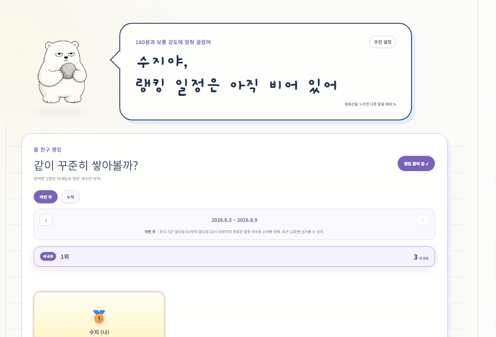
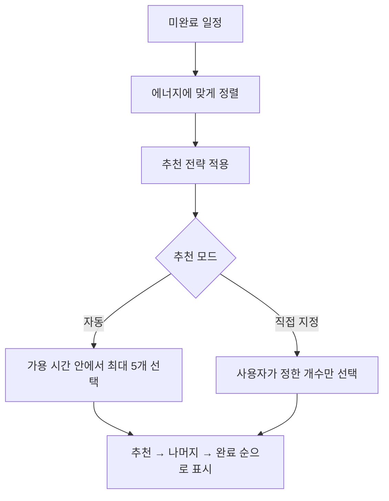
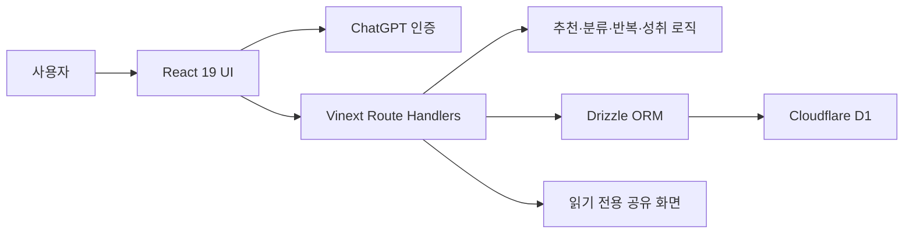

<div align="center">

# 오늘 뭐하지? · Today Focus

**해야 할 일은 많은데 무엇부터 시작할지 막막할 때,**<br>
현재 에너지와 사용할 수 있는 시간에 맞춰 오늘의 시작점을 정해 주는 일정 관리 서비스입니다.

[서비스 바로가기](https://today-focus.eunsil5523.chatgpt.site)

</div>

## 서비스 개선 기록

프로젝트는 **2026년 7월 22일**에 시작했습니다. 같은 문제를 여러 날짜에 다시 확인한 경우 하나의 항목으로 합치고, 최초 제보일과 재확인 날짜를 함께 남겼습니다. 각 항목을 펼치면 문제 상황과 개선 방향을 볼 수 있습니다.

<details>
<summary><strong>날짜·시간 입력을 달력과 시계 중심으로 개선</strong> · 2026.07.22, 07.24, 08.01</summary>

- **발견:** 직접 입력하거나 긴 선택 목록을 사용하는 방식은 날짜와 시간을 빠르게 고르기 어려웠습니다. 시간은 1시간, 분은 5분 단위가 필요했고 종일 일정도 구분되어야 했습니다.
- **개선:** 날짜 선택은 달력, 시간 선택은 시계형 입력으로 통일하고 종일·시작·종료 시간을 한 흐름에서 설정하도록 정리했습니다. 반복 종료일 달력이 열렸을 때 뒤쪽 화면이 스크롤되지 않도록 하는 조건도 함께 다뤘습니다.

</details>

<details>
<summary><strong>한국 시간 기준에서 날짜가 하루 어긋나는 문제</strong> · 2026.07.27, 08.03</summary>

- **발견:** 현재 날짜나 반복 일정 날짜가 하루 전으로 보이는 경우가 있었습니다.
- **원인:** 브라우저·서버·데이터베이스가 서로 다른 시간대 기준으로 날짜를 해석할 수 있었습니다.
- **개선:** 날짜 경계와 반복 일정 계산을 한국 시간(KST) 기준으로 통일하고, 자정 전후 조건을 테스트 대상으로 남겼습니다.

</details>

<details>
<summary><strong>일정 추가 후 캘린더가 바로 갱신되지 않는 문제</strong> · 2026.07.29, 08.03</summary>

- **발견:** 일정 등록은 성공했지만 이미 열어 둔 기록 캘린더에는 새 일정이 즉시 나타나지 않았습니다.
- **원인:** 월별 기록 결과가 이전 요청 상태를 유지해 일정 추가 사실을 알지 못했습니다.
- **개선:** 일정 변경 신호를 캘린더에 전달하고 기록 요청이 최신 데이터를 다시 읽도록 처리했습니다.
- **검증:** 로그인 사용자가 일정을 추가한 직후 현재 캘린더에 반영되는 조건을 회귀 테스트로 확인합니다.

</details>

<details>
<summary><strong>퐁당퐁당 일정처럼 서로 떨어진 여러 날짜 선택</strong> · 2026.08.04</summary>

- **발견:** 기존 날짜 입력은 하루 또는 연속 기간 중심이라 월·수·금처럼 떨어진 날짜를 한 번에 등록하기 어려웠습니다.
- **개선:** 달력에서 여러 날짜를 각각 선택·해제할 수 있게 하고, 중복·잘못된 날짜를 제거해 정렬한 뒤 저장하도록 했습니다.
- **검증:** 선택 순서가 달라도 같은 날짜 목록이 만들어지는지와 최대 선택 개수 제한을 단위 테스트로 확인합니다.

</details>

<details>
<summary><strong>반복 일정의 한 회차와 전체 일정 처리 분리</strong> · 2026.07.24, 08.03</summary>

- **발견:** 특정 날짜만 완료·삭제·건너뛰고 싶어도 반복 일정 전체 상태와 섞일 수 있었고, 오늘 회차를 지우면서 과거 기록과 돌 보상까지 사라질 위험이 있었습니다.
- **개선:** 일정 원본과 날짜별 완료·건너뛰기 기록을 분리하고, ‘이번 일정만’과 ‘전체 반복 일정’을 명확히 구분했습니다. 반복 시작일·종료일도 함께 관리합니다.
- **검증:** 단발·매일·기간 반복 일정이 날짜별로 올바르게 펼쳐지고 과거 기록이 보존되는지 확인합니다.

</details>

<details>
<summary><strong>과거 일정 완료와 돌 보상의 중복·누락 방지</strong> · 2026.07.24, 08.03</summary>

- **발견:** 과거 기록에서 일정을 완료하면 돌이 즉시 늘어나지 않거나, 오늘 화면과 과거 기록 양쪽에서 같은 완료가 중복 집계될 수 있었습니다.
- **개선:** 날짜별 완료 기록을 단일 기준으로 삼고, 완료 변경과 돌 보상 갱신을 함께 처리하도록 정리했습니다.

</details>

<details>
<summary><strong>기록 캘린더 로딩과 화면 전환 속도 개선</strong> · 2026.07.24</summary>

- **발견:** 기록 화면에 들어갈 때 데이터가 준비될 때까지 화면이 멈춘 것처럼 보였습니다.
- **개선:** 로딩 상태를 명확히 보여 주고 필요한 월 데이터만 불러오도록 범위를 줄였습니다.

</details>

<details>
<summary><strong>모바일·태블릿에서 캘린더와 모달이 겹치는 문제</strong> · 2026.07.29, 08.01</summary>

- **발견:** 화면 너비가 애매한 태블릿 구간에서 캘린더·모달·버튼이 겹치거나 화면 밖으로 밀릴 수 있었습니다.
- **개선:** 앱 컨테이너 너비를 기준으로 레이아웃을 전환하고, 모바일 전용 캘린더 스트립과 안전 영역 대응을 추가했습니다.
- **검증:** 주요 컨트롤이 모바일·태블릿 화면 안에 유지되는지 반응형 회귀 조건으로 확인합니다.

</details>

<details>
<summary><strong>최근 일정 자동완성으로 반복 입력 줄이기</strong> · 2026.07.30</summary>

- **발견:** 자주 등록하는 일정을 매번 처음부터 입력해야 했습니다.
- **개선:** 최근 일정 제목·분류·소요 시간을 검색해 화살표 키, Enter, 마우스로 선택할 수 있게 하되 새로운 제목 입력은 막지 않도록 했습니다.

</details>

<details>
<summary><strong>‘기타’ 분류 안내가 실제 이유와 맞지 않는 문제</strong> · 2026.07.30</summary>

- **발견:** 원래 기타에 적합한 일정과 분류가 애매해 임시로 기타에 들어간 일정에 같은 문구가 표시됐습니다.
- **개선:** 자연스러운 기타 분류, 애매한 임시 분류, 사용자가 직접 선택한 기타를 구분해 안내합니다.
- **검증:** 세 조건을 각각 단위 테스트로 확인합니다.

</details>

<details>
<summary><strong>같은 내용의 공유 링크가 계속 새로 생성되는 문제</strong> · 2026.07.30</summary>

- **발견:** 같은 일정을 다시 공유해도 선택 순서가 다르면 새로운 링크로 판단할 수 있었고, 기존 링크 재사용과 새 링크 생성 문구도 구분되지 않았습니다.
- **개선:** 일정 ID를 중복 제거·정렬해 비교하고 내용과 만료 조건이 같으면 기존 링크를 재사용합니다.
- **검증:** 순서만 다른 경우와 실제 내용이 달라진 경우를 나눠 확인합니다.

</details>

<details>
<summary><strong>돌곰이 이미지·말풍선·한국어 줄바꿈 개선</strong> · 2026.07.28, 07.29, 08.01</summary>

- **발견:** 일부 곰 이미지가 입만 강조되어 낯설게 보였고, 같은 문구가 반복되거나 한국어가 어색한 위치에서 줄바꿈됐습니다. 말풍선이 버튼인지 안내인지도 헷갈릴 수 있었습니다.
- **개선:** 상황별 표정과 문구를 늘리고 말풍선 클릭 시 문구가 바뀌도록 했습니다. 숫자·단위와 이름 호격이 자연스럽게 묶이도록 줄바꿈 규칙을 보완하고 도움말 표시 여부를 설정할 수 있게 했습니다.

</details>

<details>
<summary><strong>잠긴 돌·돌 이름·외형의 식별성 개선</strong> · 2026.07.29, 08.01</summary>

- **발견:** 잠긴 돌의 실루엣이 잘 보이지 않았고, 햇살돌·우유빛돌·토스트돌·복숭아돌처럼 이름과 외형의 인상이 맞지 않는 사례가 있었습니다.
- **개선:** 잠금 상태의 대비를 높이고 이름·색·질감을 함께 점검했습니다. 장기 목표를 해치지 않는 범위에서 돌 종류도 확장했습니다.

</details>

<details>
<summary><strong>돌 이미지 로딩과 도감 정보 밀도 개선</strong> · 2026.07.31, 08.01</summary>

- **발견:** 돌 이미지가 비어 보이거나 한 화면에 글자가 지나치게 많았고, 이미지가 많아질수록 로딩 부담이 커졌습니다.
- **개선:** 이미지 비동기 로딩·재사용을 적용하고 카드의 이름과 핵심 상태를 우선 보여 주도록 정보 밀도를 조정했습니다.

</details>

<details>
<summary><strong>완료 개수와 원형 진행률 표시 정확도 개선</strong> · 2026.07.31</summary>

- **발견:** ‘2/3 완료’처럼 숫자와 단위 간격이 어색했고, 실제 비율과 원형 그래프의 채움 정도가 맞지 않는 경우가 있었습니다.
- **개선:** 텍스트 간격을 정리하고 완료율 계산값을 하나의 기준으로 사용하도록 했습니다.

</details>

<details>
<summary><strong>돌 성장 컬렉션의 간격과 단계 다양성 개선</strong> · 2026.08.01</summary>

- **발견:** 돌 사이에 빈틈이 생기거나 공중에 떠 보였고 특정 돌은 지나치게 컸습니다. 성장 단계도 배경만 달라져 반복적으로 느껴졌습니다.
- **개선:** 돌 크기와 쌓임 기준을 통일하고, 단계마다 장면과 구성 변화가 드러나도록 성장 이미지를 정리했습니다.

</details>

<details>
<summary><strong>버그·기능 제안 화면의 로딩·상태·답변 노출 개선</strong> · 2026.08.01, 08.04</summary>

- **발견:** 화면 진입이 느린데 로딩 안내가 없었고, 접수·처리 중·완료 상태와 관리자 답변이 어디에 보이는지 불명확했습니다.
- **개선:** 전용 로딩 화면을 추가하고 처리 상태와 답변 위치를 분리해 표시합니다. 답변은 해당 제보 작성자만 확인하도록 유지합니다.

</details>

<details>
<summary><strong>동시 요청의 중복 저장과 최신 수정 덮어쓰기 방지</strong> · 2026.08.03</summary>

- **발견:** 일정 추가를 연속으로 누르거나 여러 화면에서 같은 일정을 수정하면 중복 생성 또는 최신 값 덮어쓰기가 발생할 수 있었습니다. 사용자 증가 상황의 처리 한계도 확인할 필요가 있었습니다.
- **개선:** 요청 ID 기반 멱등성, 쓰기 속도 제한, version 비교 기반 낙관적 동시성 제어를 적용하고 부하 시나리오를 점검했습니다.
- **검증:** 동일 요청 재전송·짧은 시간의 연속 요청·오래된 수정 요청을 각각 구분합니다.

</details>

<details>
<summary><strong>랭킹 참여 동의와 개인정보 보호, 확장 가능한 탐색</strong> · 2026.08.03</summary>

- **발견:** 첫 진입 시 닉네임과 공개 범위를 명확히 안내할 필요가 있었고, 참여자가 늘어날 때 전체 목록을 한 번에 보여 주는 방식은 적합하지 않았습니다.
- **개선:** 명시적으로 참여한 사용자만 닉네임과 완료 개수를 공개하고 이메일·일정 내용은 노출하지 않습니다. 상위 100위, Top 3, 페이지 탐색, 내 순위를 분리했습니다.

</details>

<details>
<summary><strong>주간 랭킹의 집계 기준·기간·과거 주차 표시</strong> · 2026.08.04</summary>

- **발견:** ‘주간’이 어떤 요일과 시간대를 기준으로 하는지 알 수 없었고, 1주차·2주차처럼 지난 기록을 볼 수 있는지도 불명확했습니다.
- **개선:** 월요일부터 일요일까지의 한국 시간 기준 날짜 범위를 화면에 표시하고, 최근 12주의 이전·다음 주 이동을 제공합니다. 누적 랭킹과의 차이도 함께 설명합니다.

</details>

<details>
<summary><strong>랭킹 문구·1위 카드·로딩 위치 개선</strong> · 2026.08.04</summary>



- **발견:** 일반 일정용 말풍선이 랭킹 화면 상태와 맞지 않았고, 참여자가 1명일 때 1위 카드에 빈 공간이 지나치게 많았습니다. 로딩용 보라색 돌도 왼쪽으로 치우쳐 보였습니다.
- **개선:** 랭킹에서는 ‘돌 친구 랭킹 / 같이 꾸준히 쌓아볼까?’라는 전용 안내를 사용하고 참여 인원·닉네임·완료 개수에 집중한 큰 카드로 정리했습니다. 돌곰이는 카드 오른쪽 아래에서 랭킹을 설명하며, 로딩 애니메이션은 중앙에 고정했습니다.
- **검증:** 주간·누적 선택에 따라 기준 문구와 날짜가 바뀌고, 랭킹 전용 문구가 사라지지 않는지 회귀 테스트로 확인합니다.

</details>

## 개발 및 운영 트러블슈팅

제품 사용 중 발견한 기능 문제와, 개발·배포 과정에서 발생한 운영 문제를 분리해 기록합니다.


<details>
<summary><strong>Vinext 링크 오류로 버그·기능 제안 화면이 무한 로딩되는 문제</strong> · 2026.08.05</summary>

- **증상:** ‘버그·기능 제안’을 누르면 로딩 화면이 끝나지 않았고, 브라우저에는 `RSC prefetch setup error`, `f is not a function`, 폰트 파일 404가 함께 나타났습니다.
- **원인:** `/feedback` 경로가 삭제된 것은 아니었습니다. Vinext의 클라이언트 사전 불러오기 링크가 운영 환경에서 실행 오류를 일으켰고, 자동 폰트 생성 주소에는 로컬 작업 폴더 경로가 포함됐습니다.
- **대응:** 의견함과 관련 화면 이동을 안정적인 전체 페이지 이동으로 바꾸고, 잘못된 운영 주소를 만들던 자동 폰트 생성을 제거했습니다.
- **검증:** 빌드 결과에 `/feedback` 경로가 포함되는지, 의견함 링크에 사전 불러오기가 다시 들어오지 않는지, 로컬 폰트 경로가 생성되지 않는지를 회귀 테스트로 확인했습니다. 전체 68개 테스트와 정적 검사를 통과한 뒤 운영 배포했습니다.

</details>
<details>
<summary><strong>일정 자동완성에서 런타임 오류 발생</strong> · 2026.08.03</summary>

- **증상:** 일정 입력 중 `normalizeTitle is not defined` 오류가 발생했습니다.
- **대응:** 제목 정규화 함수의 선언·가져오기 범위를 확인하고 자동완성 경로에서 항상 사용할 수 있도록 연결했습니다. 같은 입력 흐름을 테스트해 재발 여부를 확인했습니다.

</details>

<details>
<summary><strong>ESLint 오류로 배포 전 검증이 중단되는 문제</strong> · 2026.08.03</summary>

- **증상:** 사용하지 않는 값, 의존성 배열, 타입 관련 규칙 위반으로 정적 검사가 실패했습니다.
- **대응:** 실제 동작 변경과 규칙 정리를 분리해 오류를 수정하고, 배포 전에 `npm run lint`와 `npm test`를 함께 실행하는 절차를 유지했습니다.

</details>

<details>
<summary><strong>Cloudflare 기본 호환 모드 변경으로 Sites 배포 실패</strong> · 2026.08.04</summary>

- **증상:** `nodejs_compat`가 플랫폼 기본값이 된 날짜 이후에도 같은 호환 플래그를 명시해 배포가 거부됐습니다.
- **원인:** 애플리케이션 기능 코드가 아니라 호스팅 플랫폼의 기본 호환 기준이 변경된 것이 원인이었습니다.
- **대응:** 중복된 `nodejs_compat` 명시를 제거하고 Sites가 관리하는 현재 Cloudflare 기준을 따르도록 했습니다. 같은 버전을 반복 생성하지 않고 배포 상태를 확인한 뒤 운영 배포를 완료했습니다.

</details>

<details>
<summary><strong>Sites 저장소 반영과 GitHub 푸시를 혼동한 문제</strong> · 2026.08.04</summary>

- **증상:** Sites 내부 소스에는 커밋이 있었지만 사용자가 확인하는 GitHub `main`에는 보이지 않았습니다.
- **원인:** Sites가 사용하는 내부 소스 저장소와 공개 GitHub 저장소는 서로 다른 원격 저장소입니다.
- **대응:** 두 저장소의 목적과 최신 커밋을 별도로 확인하고, README 같은 공개 문서는 GitHub `main`에 직접 커밋해 반영 여부를 다시 조회합니다.

</details>

<details>
<summary><strong>README에 실제 화면 증빙을 남기는 과정</strong> · 2026.08.01, 08.04–08.05</summary>

- **요구:** 구현 설명만 적지 않고 실제 문제 화면을 캡처해 개선 기록과 함께 보여 줄 필요가 있었습니다.
- **대응:** 대화에 첨부된 실제 랭킹 화면을 저장소 이미지로 보존하고 관련 토글 안에 배치했습니다. 자동 대표 캡처가 스타일 적용 전 화면처럼 부정확한 경우에는 증빙으로 사용하지 않습니다.
- **제약:** 다른 대화에만 첨부된 이미지는 현재 대화에서 임의로 가져올 수 없으므로, 접근 가능한 원본과 새로 검증한 캡처만 사용합니다.

</details>

## 프로젝트 한눈에 보기

| 항목 | 내용 |
| --- | --- |
| 프로젝트 형태 | 개인 맞춤형 웹 서비스 · 1인 프로젝트 |
| 진행 기간 | 2026.07.22 ~ 계속 개선 중 |
| 담당 역할 | 서비스 기획, 요구사항 정의, UX 설계, 테스트 시나리오 작성, 결함 재현·수정 확인 |
| 개발 방식 | ChatGPT Sites를 활용한 구현과 사용자 관점의 반복 QA |
| 핵심 가치 | 할 일의 **선택 부담을 줄이고**, 완료 경험을 **눈에 보이는 성장 기록**으로 바꾸기 |
| 배포 환경 | Cloudflare Workers · Cloudflare D1 |

> 단순한 To-do CRUD보다 “지금 무엇부터 할까?”라는 결정 피로를 줄이는 데 초점을 맞췄습니다. 일정 추천, 반복 일정, 캘린더, 공유, 피드백, 장기 성취 콘텐츠를 하나의 흐름으로 연결했습니다.

## 문제 정의

할 일을 기록해도 목록이 길어지면 다시 우선순위를 정해야 합니다. 컨디션이 좋지 않은 날에는 긴 작업이 먼저 보이는 것만으로도 시작이 어려워지고, 완료 기록이 숫자로만 남으면 꾸준히 사용할 동기도 약해집니다.

오늘 뭐하지?는 이 문제를 다음과 같이 풀었습니다.

1. 사용자가 오늘의 **에너지와 가용 시간**을 정합니다.
2. 서비스가 완료하지 않은 일정 중 지금 실행하기 좋은 일을 골라 앞에 배치합니다.
3. 완료한 일정은 날짜별 기록과 돌 친구로 남습니다.
4. 누적 기록은 돌도감과 성장 컬렉션으로 이어져 장기적인 성취를 보여 줍니다.

## 핵심 기능

| 기능 | 구현 내용 | 사용자에게 주는 가치 |
| --- | --- | --- |
| 오늘 일정 추천 | 에너지 3단계, 가용 시간, 균형·빠른 완료·집중 전략, 선호 분류를 조합해 최대 5개 추천 | 긴 목록에서 시작할 일을 다시 고르는 부담 감소 |
| 일정 관리 | 등록·수정·삭제, 오늘·내일·날짜 지정, 매일·기간 반복, 종일 일정 지원 | 단발 일정과 반복 루틴을 한곳에서 관리 |
| 최근 일정 자동완성 | 이전에 입력한 일정 기록을 검색해 제목·분류·소요 시간을 키보드와 마우스로 선택 | 반복 입력 시간을 줄이면서 새 일정 입력 흐름 보존 |
| 맞춤 분류 | 취업·공부·프로젝트·일상·기타 규칙 분류 후 사용자가 수정한 결과를 계정별로 우선 반영 | 사용할수록 개인 기준에 가까운 분류 제공 |
| 기록 캘린더 | 날짜별 일정과 완료율, 완료한 돌 친구, 과거 기록 추가, 분류 필터 제공 | 언제 무엇을 끝냈는지 시각적으로 확인 |
| 돌 친구 랭킹 | 공개에 동의한 사용자의 주간·누적 완료 수, 최근 12주 기록, 상위 100위와 내 순위 제공 | 꾸준함을 다른 사용자와 비교하되 이메일과 할 일 내용은 비공개 |
| 성취 컬렉션 | 완료 수 1~15,000개 구간에 224종 돌 친구와 48단계 성장 장면을 해금 | 작은 완료가 장기적인 수집과 성장 경험으로 연결 |
| 상황별 곰 캐릭터 | 따뜻함·냉정함·적극적·활발함 4가지 말투와 진행 상태별 표정·문구 제공 | 같은 기능도 사용자가 선호하는 방식으로 격려 |
| 읽기 전용 공유 | 선택한 일정 또는 돌 컬렉션을 30일 링크로 공유하고, 같은 내용은 기존 링크 재사용 | 개인 데이터 수정 권한 없이 결과만 안전하게 공유 |
| 버그·기능 제안 | 서비스 안에서 의견을 보내고 처리 상태와 관리자 답변 확인 | 실제 사용 중 발견한 문제를 제품 개선 흐름으로 연결 |

## 추천 로직

추천은 외부 생성형 AI 호출이 아니라, 결과를 예측하고 테스트할 수 있는 규칙 기반 로직으로 동작합니다.



- **에너지 낮음**: 짧은 일정부터 제안합니다.
- **에너지 높음**: 긴 집중 작업을 우선합니다.
- **균형 전략**: 특정 분류에만 치우치지 않도록 분류별 일정을 번갈아 배치합니다.
- **빠른 완료 전략**: 예상 소요 시간이 짧은 일정부터 배치합니다.
- **집중 전략**: 사용자가 선택한 분류를 먼저 배치합니다.
- **다시 추천**: 완료 상태는 유지하고 미완료 후보의 시작 위치만 바꿉니다.

## 시스템 구조



### 데이터 흐름

- 인증된 사용자의 이메일을 데이터 소유자 키로 사용해 일정·설정·완료 기록을 분리합니다.
- 반복 일정 자체와 날짜별 완료·건너뛰기 기록을 분리해, 한 번의 완료가 전체 반복 일정에 영향을 주지 않도록 했습니다.
- 일정 완료 시 날짜별 완료 기록과 돌 보상을 함께 저장하고, 누적값을 다시 계산해 UI에 반영합니다.
- 공유 시 요청한 일정이 현재 사용자의 소유인지 다시 확인한 뒤 읽기 전용 토큰을 발급합니다.

## 테스트

핵심 도메인 로직과 화면 회귀 조건을 Node.js 내장 테스트 러너로 검증합니다. 현재 **16개 테스트 파일, 68개 테스트 케이스**가 포함되어 있습니다.

- 에너지·시간·전략별 추천 순서와 재추천
- 자동 분류, 사용자 수정 우선순위, 기타 분류 사유
- 단발·매일·기간 반복 일정과 한국 시간 날짜 경계
- 일정 입력 자동완성과 공유 링크 재사용
- 쓰기 요청 속도 제한과 낙관적 동시성 처리 조건
- 224종 돌도감, 48단계 성장 컬렉션, 특별 숫자 이스터에그
- 모바일·태블릿 반응형 CSS와 일정 추가 후 캘린더 갱신
- 한국어 이름 호격 및 숫자·단위 줄바꿈

```bash
npm run lint
npm test
```

## 기술 스택

| 구분 | 기술 | 사용 목적 |
| --- | --- | --- |
| Frontend | React 19, TypeScript 5.9 | 상태 기반 UI와 타입 안전성 |
| Full-stack runtime | Vinext, Vite, Next.js 호환 Route Handlers | React 기반 전체 화면과 서버 API 구성 |
| Styling | Tailwind CSS 4, CSS Container Queries | 데스크톱·태블릿·모바일 반응형 UI |
| Database | Cloudflare D1, Drizzle ORM | 사용자별 일정·완료·설정·공유 데이터 저장 |
| Deployment | Cloudflare Workers | 엣지 런타임 배포 |
| Authentication | ChatGPT 사용자 인증 헤더 | 로그인 사용자 식별과 데이터 격리 |
| Test | Node.js Test Runner | 추천·분류·일정·공유·성취 및 렌더링 회귀 검증 |

## 프로젝트 구조

```text
today-focus/
├── app/
│   ├── api/                 # 일정, 기록, 공유, 피드백 API
│   ├── dashboard.tsx        # 메인 일정 관리 화면
│   ├── history-calendar.tsx # 기록 캘린더
│   └── stone-*.tsx          # 돌도감과 성장 컬렉션 UI
├── db/                      # Drizzle 연결과 스키마
├── drizzle/                 # Cloudflare D1 마이그레이션
├── lib/                     # 추천·분류·반복·공유·성취 도메인 로직
├── postgres/                # PostgreSQL 확장용 초기 스키마
├── public/                  # 곰 캐릭터와 성장 컬렉션 이미지
├── tests/                   # 자동 테스트
└── worker/                  # Cloudflare Workers 진입점
```

## 로컬 실행

### 1. 요구 사항

- Node.js 22.13 이상
- npm

### 2. 설치 및 실행

```bash
git clone https://github.com/3suji3/today-focus.git
cd today-focus
npm ci
npm run dev
```

### 3. 환경 변수

`.env.example`을 참고해 로컬 환경 파일을 작성합니다. 비밀값과 실제 사용자 데이터는 저장소에 커밋하지 않습니다.

기본 운영 데이터베이스는 Cloudflare D1입니다. PostgreSQL 확장 방법은 [POSTGRES_SETUP.md](./POSTGRES_SETUP.md)와 [`postgres/001_initial.sql`](./postgres/001_initial.sql)을 참고할 수 있습니다.

## 개발 및 QA 과정

이 프로젝트에서는 기능 개수보다 실제 사용 흐름의 신뢰도를 높이는 데 시간을 더 많이 사용했습니다.

1. 직접 서비스를 사용하며 정상 흐름과 예외 상황을 확인했습니다.
2. 화면 크기, 로그인 상태, 반복 여부, 날짜, 네트워크 지연처럼 재현 조건을 바꿔 문제를 좁혔습니다.
3. 수정 후 같은 조건으로 재검증하고, 재발 가능성이 큰 로직은 자동 테스트로 남겼습니다.
4. UI 문구도 기능 상태와 정확히 일치하는지 확인했습니다. 예를 들어 자연스럽게 `기타`에 속하는 일정과 분류가 애매해 임시로 `기타`에 들어간 일정을 서로 다른 문구로 안내합니다.

---

이 저장소에는 예시 데이터만 포함하며, 운영 환경의 계정 정보·개인 일정·비밀값은 포함하지 않습니다.
